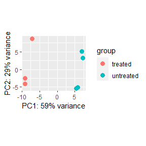
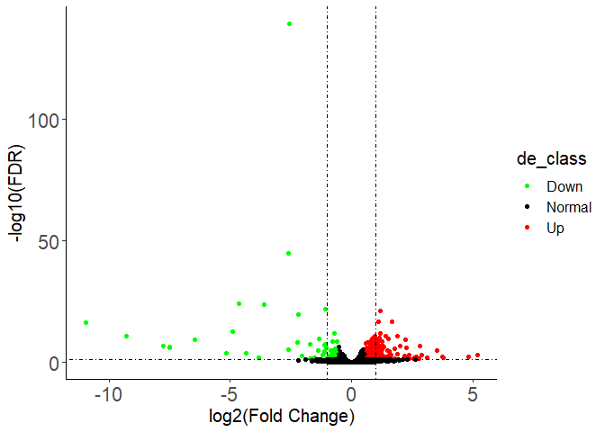
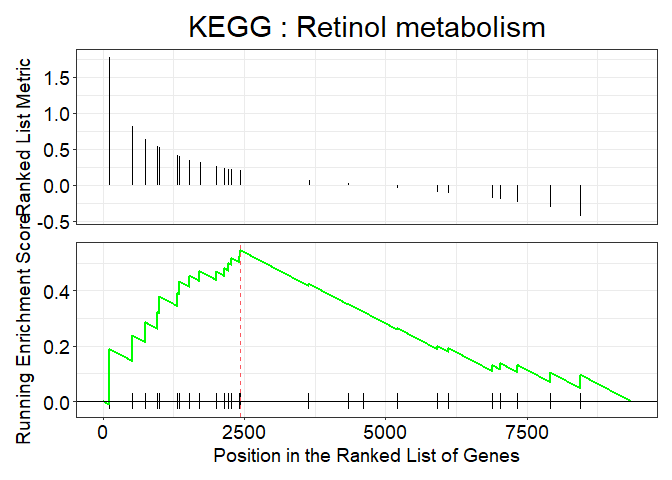
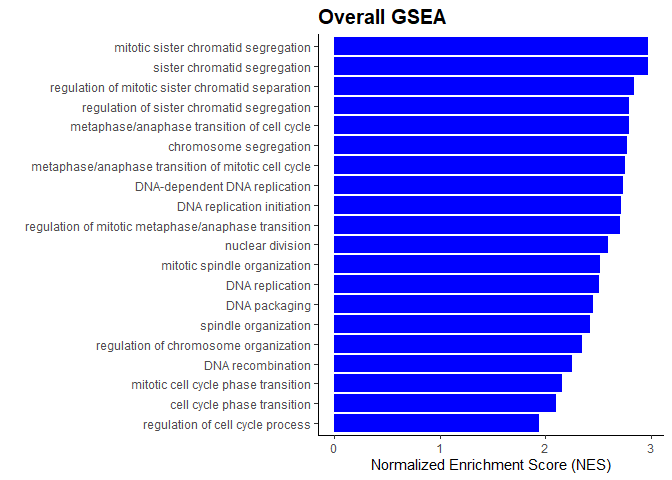
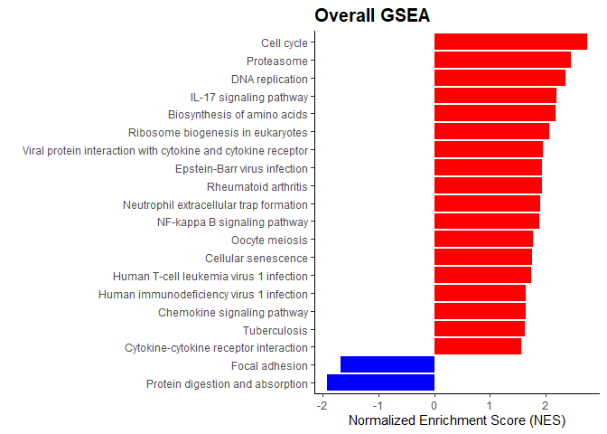

## RNAseq 工作流程

    library(RNAseqFlow)
    input <- createCountPhe()

    head(input[[1]])
    #>             treated1 treated2 treated3 untreated1 untreated2 untreated3 untreated4
    #> FBgn0000008      140       88       70         92        161         76         70
    #> FBgn0000017     6205     3072     3334       4664       8714       3564       3150
    #> FBgn0000018      722      299      308        583        761        245        310
    #> FBgn0000024       10        7        5         10         11          3          3
    #> FBgn0000032     1698      696      757       1446       1713        615        672
    #> FBgn0000037       20       14       17         15         25          9          5
    input[[2]]
    dds <- create_DEseq(count_data=input[[1]],col_data=input[[2]],design_names = "condition+type",group_name ="condition",ref_level = "untreated")
    #> [1] "The id order between gene count file and phenotype file is identical without modification!"
    res <- DESeq_res(dds,fold_change_line=0.58,adj_pvalue_line =0.05)
    DESeq_PCA(dds) # plot PCA

    volcano(res) # plot volcano

    DEsig <- row.names(res)[res$regulate!="Normal"]

## 富集分析

加载一些程序包：

    library(org.Dm.eg.db)
    library(clusterProfiler)

### GO 过度代表检验 (over-representation test)

    idType(OrgDb = org.Dm.eg.db)
    #>  [1] "ACCNUM"       "ALIAS"        "ENSEMBL"      "ENSEMBLPROT"  "ENSEMBLTRANS" "ENTREZID"    
    #>  [7] "ENZYME"       "EVIDENCE"     "EVIDENCEALL"  "FLYBASE"      "FLYBASECG"    "FLYBASEPROT" 
    #> [13] "GENENAME"     "GENETYPE"     "GO"           "GOALL"        "MAP"          "ONTOLOGY"    
    #> [19] "ONTOLOGYALL"  "PATH"         "PMID"         "REFSEQ"       "SYMBOL"       "UNIPROT"
    go_res <- enrichGO(DEsig,keyType="ENSEMBL",OrgDb=org.Dm.eg.db)
    head(go_res)

### KEGG 过度代表检验 (over-representation test)

    DEsig_entrezid <- bitr(DEsig, fromType="ENSEMBL", toType="ENTREZID", OrgDb=org.Dm.eg.db)[,2]
    kegg_res <- enrichKEGG(DEsig_entrezid,keyType="ncbi-geneid",organism="dme");
    head(kegg_res)

值得注意的是，当进行KEGG或gseKEGG时，如果物种是人类，那么基因名为ENTREZID时，对应的keyType是“kegg”或“ncbi-geneid”。当对其它物种进行分析时，ENTREZID对应的是ncbi-geneid。

### GO的GSEA分析

    gene_list <- res$log2FoldChange
    names(gene_list)=row.names(res)
    gene_list <- sort(gene_list, decreasing = TRUE)
    gsea_go_res <- gseGO(gene_list,keyType="ENSEMBL",OrgDb=org.Dm.eg.db)
    head(gsea_go_res)

    if(nrow(gsea_go_res)>=1){
      gsea_go_res <- setReadable(gsea_go_res, OrgDb = org.Dm.eg.db)
      print(gseaplot(gsea_go_res,geneSetID=gsea_go_res$ID[1],title=paste("BP : ",gsea_go_res$Description[1],sep="")))
    }

### KEGG的GSEA分析

    gsea_kegg_res <- GSEA_kegg(gene_list,type="ENSEMBL",organism = "dme",db=org.Dm.eg.db,pvalueCutoff=1)
    if(nrow(gsea_kegg_res)>1){
      print(gseaplot(gsea_kegg_res,geneSetID=gsea_kegg_res$ID[1],title=paste("KEGG : ",gsea_kegg_res$Description[1],sep="")))
    }

### GSEA using human databale

    library(org.Hs.eg.db)
    data(geneList,package = "DOSE")
    gsea_go_res <- gseGO(geneList,keyType="ENTREZID",OrgDb=org.Hs.eg.db)
    print(plot_overallGSEA(head(gsea_go_res,20),"Description","NES"))

    gsea_kegg_res <- GSEA_kegg(geneList,organism = "hsa",type = "ENTREZID")
    print(plot_overallGSEA(head(gsea_kegg_res,20),"Description","NES"))

